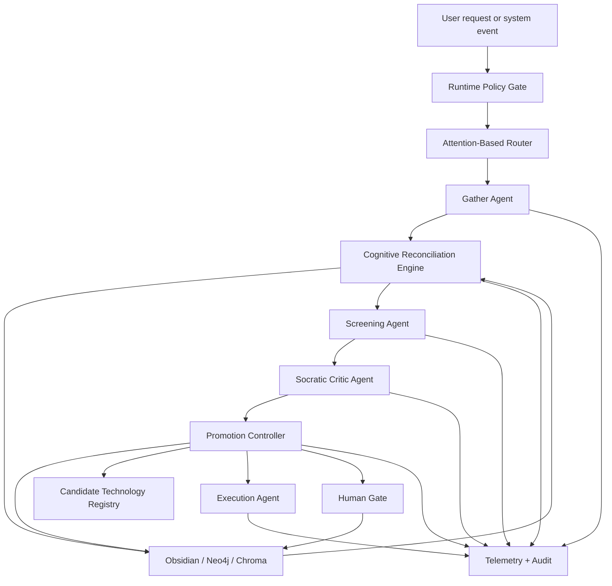

# PCA Architecture — 9-Layer System Design

**A comprehensive breakdown of the Personal Cognitive Architecture system, layer by layer.**

---

## Complete System Diagram

```mermaid
graph TD
    subgraph INPUT ["🔵 INPUT SOURCES<br/>Multi-modal capture, low-friction ingestion"]
        YT["📺 YouTube"]
        WEB["🌐 Web"]
        CHAT["💬 Chat"]
        VOICE["🎤 Voice"]
        DOCS["📄 Documents"]
        FILES["📁 Files"]
        SHORTCUTS["⚡ iPhone Shortcuts"]
    end

    subgraph CAPTURE ["🔵 CAPTURE LAYER<br/>Ingest and normalize content"]
        WHISPER["🎧 Whisper<br/>Transcription"]
        PLAYWRIGHT["🎭 Playwright<br/>Web Extraction"]
        PARSERS["⚙️ Custom Parsers<br/>Parsing"]
        NORM["📋 Normalization<br/>Text, Metadata"]
    end

    subgraph VALIDATION ["🟢 VALIDATION LAYER<br/>Score and filter for quality & relevance"]
        CRED["✓ Source Credibility"]
        QUAL["⭐ Content Quality"]
        REL["🎯 Relevance Scoring"]
        ALIGN["⚖️ Alignment Scoring"]
    end

    subgraph RECONCILE ["🟣 COGNITIVE RECONCILIATION ENGINE<br/>THE CORE DIFFERENTIATOR<br/>Compare, reconcile, and evolve knowledge"]
        GRAPHCOMP["Graph Comparison<br/>new vs. existing"]
        RELDET["Relationship Detection<br/>R/C/E/I"]
        CONF["Confidence Update<br/>Bayesian + Heuristics"]
        EVOLVE["Model Evolution<br/>Trigger restructuring"]
    end

    subgraph KNOWLEDGE ["🔵 KNOWLEDGE INTEGRATION LAYER<br/>Store, link, and structure long-term memory"]
        OBSIDIAN["📓 OBSIDIAN KNOWLEDGE GRAPH<br/>Nodes • Links • Backlinks • Tags • Properties"]
        CHROMA["🎨 Vector Database - Chroma<br/>Semantic Layer"]
        NEO4J["🕸️ Neo4j - Graph Intelligence<br/>Relationship modeling"]
    end

    subgraph REASONING ["🔵 REASONING & AGENTS LAYER<br/>Think, synthesize, and orchestrate"]
        LLM["🧠 LLMs Tiered<br/>Claude Sonnet • Claude Haiku<br/>Ollama/Qwen2.5-7B • Local"]
        FRAMEWORK["🤖 Agent Framework<br/>MCP-based"]
        RETRIEVAL["🔍 Retrieval<br/>LlamaIndex RAG"]
        TOOLS["🔧 Tools<br/>Custom + API Integrations"]
    end

    subgraph EXECUTION ["🔵 EXECUTION & AUTOMATION LAYER<br/>Trigger actions and run workflows"]
        N8N["n8n - Shared Orchestration<br/>Lane A + Lane B"]
        TASKS["✅ Tasks & To-Dos"]
        API["🔗 API Calls & Integrations"]
        SCHEDULES["⏰ Schedules & Triggers"]
    end

    subgraph OUTPUT ["🔵 OUTPUT GENERATION LAYER<br/>Create high-quality, multi-modal artifacts"]
        PPTX["📊 Presentations<br/>PowerPoint"]
        DOCX["📝 Documents<br/>Word"]
        DASH["📈 Dashboards<br/>Web"]
        AUDIO["🎵 Audio Summaries<br/>MP3"]
    end

    subgraph INFRA ["🔵 INFRASTRUCTURE & DEPLOYMENT<br/>Self-hosted, secure, Canadian"]
        DOCKER["🐳 Docker Containers"]
        COMPOSE["⚙️ Docker Compose<br/>Orchestration"]
        GITLAB["🦊 GitLab<br/>CI/CD & Version Control"]
        BACKUP["☁️ Cloud Backup Canada<br/>Restic + Backblaze B2"]
    end

    subgraph GOVERNANCE ["🔵 GOVERNANCE & ETHICS"]
        PRIVACY["🔒 Privacy & Data Protection"]
        BIAS["⚖️ Bias Detection & Mitigation"]
        HITL["👤 Human-in-the-Loop Gates"]
        AUDIT["📋 Auditability & Logging"]
    end

    INPUT --> CAPTURE
    CAPTURE --> VALIDATION
    VALIDATION --> RECONCILE
    RECONCILE --> KNOWLEDGE
    KNOWLEDGE --> REASONING
    REASONING --> EXECUTION
    EXECUTION --> OUTPUT
    OUTPUT --> INFRA
    INFRA -.-> GOVERNANCE

    style INPUT fill:#e1f5ff
    style CAPTURE fill:#e1f5ff
    style VALIDATION fill:#c8e6c9
    style RECONCILE fill:#f3e5f5
    style KNOWLEDGE fill:#e1f5ff
    style REASONING fill:#e1f5ff
    style EXECUTION fill:#e1f5ff
    style OUTPUT fill:#e1f5ff
    style INFRA fill:#e1f5ff
    style GOVERNANCE fill:#f1f8e9
```



---

## Layer-by-Layer Breakdown

### Layer 1: Input Sources 🔵

**Purpose:** Multi-modal, low-friction ingestion from diverse sources

**Components:**
- **YouTube** → Video capture via iPhone Shortcuts
- **Web** → Browser bookmarks, shared links, web articles
- **Chat** → Messages, Slack, Teams, Discord
- **Voice** → Voice memos, transcribed calls
- **Documents** → PDFs, research papers, books
- **Files** → Local files, notes, Markdown
- **iPhone Shortcuts** → One-tap capture from any app

**Design Principle:** Minimize friction. Users should be able to capture from anywhere in <5 seconds.

**Status:** ✅ Partially Complete (FastAPI endpoints ready, Shortcuts UX to improve)

---

### Layer 2: Capture Layer 🔵

**Purpose:** Normalize and structure raw inputs into canonical format

**Components:**
- **Whisper API** — Transcribe audio (voice memos, video audio)
- **Playwright** — Extract web content (articles, metadata)
- **Custom Parsers** — Handle specific formats (PDFs, emails, Markdown)
- **Normalization** — Standardize metadata (timestamps, authors, sources)

**Flow:**
```
Raw Input → Extraction → Parsing → Normalization → Structured Data
```

**Output Format:**
```json
{
  "id": "capture-uuid",
  "source_type": "youtube",
  "content": "full text or transcript",
  "metadata": {
    "title": "...",
    "author": "...",
    "url": "...",
    "captured_at": "ISO8601",
    "duration": "minutes"
  }
}
```

**Status:** ✅ Sprint 1 Complete (FastAPI endpoints, Neo4j storage)

**Implementation:** `backend/app/services/` and n8n workflows

---

### Layer 3: Validation Layer 🟢

**Purpose:** Intelligently filter content before integration into knowledge system

**Key Innovation:** **Disagreement-Driven Validation** — a dueling-agent assurance pattern where one agent scores or proposes, a second agent challenges using Socratic critique, and material disagreement becomes a governance signal.

**Components:**
1. **Screening Agent** (Claude Sonnet, T=0.3)
   - Conservative assessment
   - Consistent, deterministic scoring
   - Focuses on core quality dimensions
   - Produces the primary validation proposal

2. **Socratic Critic Agent** (Claude Haiku, T=0.8)
   - Independent critical assessment
   - Uses Socratic challenge to test assumptions, weak evidence, edge cases, and premature promotion
   - Probes for gaps, contradictions, misalignment, and overconfidence

3. **4-Dimension Scoring:**
   - **Source Credibility** (0-100): Creator trustworthiness
   - **Content Quality** (0-100): Intellectual rigor
   - **Relevance** (0-100): Alignment with user goals (≥60 is hard floor)
   - **Alignment** (0-100): Ethical & methodological alignment

4. **Agreement Gate:**
   - Difference <15 points per dimension = agreement
   - All 4 dimensions agree = high confidence (95%)
   - Partial disagreement = medium confidence (40-70%)
   - Most disagree = low confidence (20%)
   - **Per-dimension floor:** If Relevance <60, routes to INBOX regardless of other scores
   - Material disagreement routes to revision, reconciliation, INBOX, or human review

5. **3-Tier Routing:**
   - **PROMOTE** (>80 overall AND all dimensions pass): Integrate immediately
   - **INBOX** (60-80 OR per-dimension floor triggered OR material disagreement): Manual review required
   - **ARCHIVE** (<60): Store but don't prioritize

**Why Not Single Agent + Confidence?**
- Model confidence is unreliable (overconfident on easy, underconfident on hard)
- Agent disagreement is interpretable (tells us WHERE confidence is low)
- Socratic critique exposes hidden assumptions instead of simply producing a second score
- Dual agents naturally integrate human review
- Multi-agent validation reduces correlated failure modes

**Status:** ✅ Sprint 5 Complete (ready to build in n8n)

**Implementation:** 9-node n8n workflow (see `SPRINT_5_N8N_SETUP_VALIDATION_LAYER.md`)

---

### Layer 4: Cognitive Reconciliation Engine 🟣

**Purpose:** THE CORE DIFFERENTIATOR — Compare new knowledge against existing knowledge graph

**Components:**

1. **Graph Comparison**
   - Compare new content against existing Neo4j nodes
   - Detect: exact duplicates, near-duplicates, derivatives

2. **Relationship Detection**
   - **Reinforce:** Strengthens existing knowledge
   - **Contradict:** Challenges existing beliefs
   - **Expand:** Adds new dimensions or examples
   - **Ignore:** Irrelevant to existing graph

3. **Confidence Update**
   - Bayesian inference: combine new evidence with prior belief
   - Formula: P(knowledge | new evidence) = P(evidence | knowledge) × P(knowledge) / P(evidence)
   - Heuristics: agreement from multiple sources increases confidence

4. **Model Evolution**
   - When inconsistencies detected: flag for review
   - When gaps detected: suggest new research areas
   - Trigger restructuring: merge, split, or reorganize concepts

**Flow:**
```
New Content
    ↓
Compare against Neo4j
    ↓
Detect relationship type (R/C/E/I)
    ↓
Update confidence via Bayesian
    ↓
Trigger action if needed
    ├─ Flag for manual review (contradiction)
    ├─ Update existing node (reinforce)
    ├─ Link new node (expand)
    └─ Archive (ignore)
```

**Status:** 🔲 Phase 2 (planned but not yet implemented)

**Why Phase 2?** Need validation layer (Layer 3) complete first. Phase 2 will consume validation signals and training data from user's INBOX decisions.

---

### Layer 5: Knowledge Integration Layer 🔵

**Purpose:** Store knowledge in multiple formats optimized for different use cases

**Triple-Layer Storage:**

#### 5a. Obsidian Knowledge Graph
- **Format:** Markdown with YAML front matter
- **Structure:** Nodes (documents), links (relationships), backlinks (reverse links), tags, properties
- **Use Case:** Human-readable knowledge, navigation, editing
- **Location:** `/Captures/` folder in Obsidian vault
- **Example Node:**
```markdown
---
title: "Agentic System Design Patterns"
tags: [architecture, agents, design-patterns]
created: 2026-05-11
confidence: 95
routing: PROMOTE
---

# Agentic System Design Patterns

[Link to related concept](concept-link)
[Reference to source](youtube-capture)

## Key Ideas
- Agent disagreement signals uncertainty better than confidence scores
- Human-in-the-loop gates ensure accountability
- ...
```

#### 5b. Neo4j Graph Database
- **Format:** Property graph (nodes + relationships + properties)
- **Structure:** Semantic relationships, indexes, constraints
- **Use Case:** Machine-readable knowledge, graph queries, pattern matching
- **Schema:**
```cypher
(VideoCapture {
  id, title, url, source,
  created_at, validated_at,
  
  # Agent-specific scores
  screening_credibility, screening_quality, screening_relevance, screening_alignment,
  critical_credibility, critical_quality, critical_relevance, critical_alignment,
  
  # Composite scores
  credibility_score, quality_score, relevance_score, alignment_score,
  overall_score, confidence, routing, agents_agree,
  
  # Metadata
  obsidian_file
})

(Concept {
  id, name, definition,
  created_at, updated_at,
  confidence_score
})

(Author {
  id, name, expertise_areas,
  credibility_score
})

RELATIONSHIPS:
- (VideoCapture)-[:CAPTURES]->(Concept)
- (VideoCapture)-[:CREATED_BY]->(Author)
- (Concept)-[:RELATES_TO]->(Concept)
- (Concept)-[:REINFORCED_BY]->(VideoCapture)
- (Concept)-[:CONTRADICTED_BY]->(VideoCapture)
```

#### 5c. Vector Database (Chroma)
- **Format:** Embeddings + metadata
- **Structure:** Semantic vectors (BGE-M3 local embeddings), similarity indices
- **Use Case:** Semantic search ("find similar ideas"), RAG retrieval
- **Flow:** Document → BGE-M3 embedding (local) → Chroma index → Similarity search
- **Privacy:** Fully local embedding generation, no external API calls

**Synchronization:**
- Obsidian → Neo4j: One-way canonical source (Phase 2)
- Neo4j → Chroma: Vector index from Neo4j nodes (Phase 3)

**Status:** ✅ Obsidian vault ready, 🔲 Neo4j schema prepared, 🔲 Chroma integration (Phase 3)

---

### Layer 6: Reasoning & Agents Layer 🔵

**Purpose:** Governed cognitive execution over the PCA knowledge graph: gather, reconcile, evaluate, promote, retrieve, synthesize, and trigger controlled actions without collapsing governance, memory, and automation into a single undifferentiated agent.

**Core Operating Model:** **GREP — Gather → Reconcile → Evaluate → Promote**

GREP is the onboarding flow for knowledge-moving agents. It ensures that new knowledge is captured with provenance, reconciled against existing memory, evaluated through Disagreement-Driven Validation, and promoted only through governed routing.

```text
Incoming Knowledge
   ↓
GATHER
Capture, normalize, classify, and preserve provenance
   ↓
RECONCILE
Use the Cognitive Reconciliation Engine to compare against existing graph, memory, and architecture
   ↓
EVALUATE
Use Disagreement-Driven Validation with Socratic critique
   ↓
PROMOTE
Route to Obsidian, Neo4j, CTCR, backlog, INBOX, archive, or controlled execution
```

**Design Principle:** Agents are bounded cognitive workers with defined roles, explicit tools, constrained memory access, observable decisions, and human escalation paths. They are not unconstrained autonomous actors.

#### 6a. Formal Capability Names

| Concept | Formal Name | Role in PCA |
|---|---|---|
| Knowledge onboarding flow | **GREP** | End-to-end movement of candidate knowledge into governed memory or action |
| Reconciliation capability | **Cognitive Reconciliation Engine** | Compares new knowledge against existing memory, detects relationships, contradictions, duplicates, and confidence changes |
| Dueling-agent assurance pattern | **Disagreement-Driven Validation** | Uses proposal + challenge to convert disagreement into a governance signal |
| Challenge style | **Socratic critique** | The critic tests assumptions, evidence, framing, omissions, contradictions, and promotion risk |

#### 6b. Agent Role Model

| Agent | Primary Role | GREP Stage | Core Outputs | Phase |
|---|---|---|---|---|
| **Capture / Gather Agent** | Normalize incoming content and preserve provenance | Gather | Structured candidate knowledge item | Phase 1 |
| **Screening Agent** | Produce the primary validation proposal | Evaluate | Scores, rationale, routing proposal | Phase 1 |
| **Socratic Critic Agent** | Challenge assumptions, evidence, fit, and premature promotion | Evaluate | Critique, disagreement signals, alternate scores | Phase 1 |
| **Reconciliation Agent** | Compare candidate knowledge against existing memory | Reconcile | Reinforce / Contradict / Expand / Duplicate / Ignore proposal | Phase 2 |
| **Promotion Controller** | Apply routing, policy, and write rules | Promote | PROMOTE / INBOX / ARCHIVE / CTCR / BACKLOG decision | Phase 2 |
| **Retrieval Agent** | Build task-specific context windows | Gather / Reconcile | Source-grounded context pack | Phase 3-4 |
| **Synthesis Agent** | Generate answers, briefs, summaries, and structured outputs | Evaluate / Promote | Draft answer, note, briefing, slide outline, document | Phase 4-5 |
| **Planner Agent** | Decompose work into steps and route execution | Promote | Task plan, tool sequence, escalation points | Phase 4-5 |
| **Execution Agent** | Trigger approved workflows and integrations | Promote | Workflow run, task creation, integration action | Phase 5 |
| **Reflection Agent** | Evaluate outputs and identify improvement signals | Evaluate | Quality notes, correction candidates, learning signals | Phase 6-7 |
| **Governance Agent** | Apply policy, sensitivity, audit, and routing controls | Cross-cutting | Allow / deny / sanitize / escalate decision | Cross-phase |

#### 6c. Disagreement-Driven Validation

Disagreement-Driven Validation is the PCA assurance pattern where one agent proposes, scores, or synthesizes, and a second agent performs a Socratic challenge. The system treats material disagreement as a governance signal that can trigger revision, reconciliation, INBOX routing, or human review.

```text
Primary Agent Proposal
   ↓
Socratic Critic Agent Challenge
   ↓
Dimension-Level Agreement Check
   ↓
Confidence Assignment
   ↓
Route: Accept / Revise / Reconcile / INBOX / Escalate
```

Disagreement is useful signal, not failure. It identifies uncertainty, ambiguity, missing context, weak evidence, policy risk, or architectural misfit.

Reusable evaluation dimensions:

- credibility
- quality
- relevance
- alignment
- novelty
- duplication risk
- contradiction risk
- architectural fit
- governance risk
- promotion readiness

#### 6d. Cognitive Reconciliation Engine in the Agent Layer

The Cognitive Reconciliation Engine is the reconciliation capability used inside GREP. It determines how new knowledge relates to the existing PCA graph and whether it should strengthen, challenge, extend, duplicate, or bypass existing memory.

| Relationship | Meaning | Typical Action |
|---|---|---|
| **Reinforce** | Supports an existing concept, claim, or decision | Increase confidence, add evidence link |
| **Contradict** | Conflicts with existing knowledge or assumptions | Route to INBOX or human review |
| **Expand** | Adds a new dimension, example, or adjacent concept | Link and enrich graph |
| **Duplicate** | Repeats existing content or known claim | Merge, ignore, or add provenance only |
| **Ignore** | Does not map to a useful PCA capability or memory need | Archive |

#### 6e. Runtime Model

Agents run through a controlled execution envelope:

```text
User Request / System Event
   ↓
Intent + Sensitivity Classification
   ↓
Runtime Policy Gate
   ↓
Attention-Based Routing
   ↓
GREP Stage Selection
   ↓
Agent Selection
   ↓
Retrieval + Tool Access
   ↓
Reasoning / Synthesis / Action Proposal
   ↓
Disagreement-Driven Validation or Cognitive Reconciliation Check
   ↓
Human Gate if required
   ↓
Execution / Output / Memory Write
   ↓
Telemetry + Audit Log
```

The Runtime Policy Gate determines what an agent is allowed to see, which model tier may be used, whether content must remain local, and whether the output requires human approval before execution or persistence.

#### 6f. Model Routing

| Route | Model / Runtime | Use Case | Constraint |
|---|---|---|---|
| **Sensitive / private** | Ollama + Qwen2.5 local | Personal memory, private notes, sensitive reasoning | No external API call |
| **Fast / low-risk** | Claude Haiku or local 7B | Classification, extraction, quick routing, critique | Low cost, bounded scope |
| **Complex synthesis** | Claude Sonnet | Architecture synthesis, executive writing, difficult reasoning | Use only after policy check |
| **Deep local synthesis** | Qwen2.5-32B local | Private reconciliation, long-context local reasoning | Requires GPU capacity |
| **Experimental / non-sensitive** | NVIDIA NIM, Open WebUI, LM Studio, other CTCR candidates | Model comparison and runtime evaluation | Sandbox only; no sensitive data |

Routing dimensions:

- sensitivity and privacy classification
- task complexity
- required latency
- cost ceiling
- confidence requirement
- tool access required
- whether memory write or external action is requested

#### 6g. Tool and Memory Access

Agents may access PCA memory through explicit tools only. Direct unrestricted memory access is not allowed.

| Capability | Preferred Access Pattern | Candidate Technology |
|---|---|---|
| Human-readable source of truth | Read/write governed Markdown | Obsidian |
| Relationship and claim graph | Query and update graph records | Neo4j |
| Semantic similarity | Vector search over derived memory | ChromaDB / BGE-M3 |
| Hybrid retrieval | Keyword + metadata + vector search | OpenSearch candidate |
| Retrieval orchestration | Build grounded context packs | LlamaIndex candidate |
| Browser capture | Controlled web extraction | Playwright |
| Voice capture | Transcription pipeline | Whisper |
| Workflow execution | Event and action orchestration | n8n |
| Tool interoperability | Standardized context/tool access | MCP candidate |
| Policy decision | Runtime allow / deny / sanitize | Open Policy Agent candidate |
| Identity boundary | Role-aware access control | Keycloak / Azure AD |

Memory writes must preserve provenance, source linkage, confidence score, routing decision, GREP stage, agent role, and whether a human reviewed the change.

#### 6h. Cognitive Health and Observability

Every significant agent run should emit telemetry:

| Metric | Purpose |
|---|---|
| `grep_stage` | Identify Gather / Reconcile / Evaluate / Promote stage |
| `agent_role` | Identify which agent executed |
| `model_used` | Track runtime/model routing decisions |
| `input_sensitivity` | Confirm policy-compliant routing |
| `retrieval_sources` | Preserve grounding and provenance |
| `confidence_score` | Support decision quality tracking |
| `disagreement_score` | Identify unstable or ambiguous decisions |
| `reconciliation_relationship` | Track Reinforce / Contradict / Expand / Duplicate / Ignore |
| `routing_outcome` | PROMOTE / INBOX / ARCHIVE / CTCR / BACKLOG / ESCALATE / EXECUTE |
| `human_review_required` | Track governance workload |
| `memory_write` | Confirm whether durable knowledge changed |
| `execution_action` | Track external side effects |

Candidate observability technologies include Prometheus + Grafana for operational metrics and Langfuse-style tracing for LLM and prompt-level analysis.

#### 6i. Agent Governance Rules

1. Agents cannot silently promote candidate technologies into adopted architecture.
2. Agents cannot write to canonical memory without provenance and routing metadata.
3. Agents cannot execute external actions without policy-gate approval.
4. Sensitive content routes local unless explicitly approved otherwise.
5. High-disagreement outputs route to INBOX or human review.
6. Reconciliation changes must distinguish evidence, inference, and decision.
7. Runtime logs must support later audit, debugging, and learning.
8. GREP promotion decisions must identify the destination: Obsidian, Neo4j, CTCR, backlog, INBOX, archive, or execution.
9. Frontier techniques such as TurboQuant or per-layer embeddings remain strategic signals until proven reproducible and governable.

#### 6j. Reference Agent Architecture



#### 6k. Status and Build Sequence

| Build Step | Description | Dependency | Status |
|---|---|---|---|
| 1 | Screening Agent + Socratic Critic Agent | Sprint 5 validation workflow | ✅ Designed |
| 2 | GREP metadata fields and agent run schema | Validation logs and Neo4j schema | 🔲 Planned |
| 3 | Runtime Policy Gate MVP | Sensitivity classification and model routing rules | 🔲 Planned |
| 4 | Cognitive Reconciliation Engine implementation | 50+ INBOX decisions and disagreement examples | 🔲 Phase 2 |
| 5 | Promotion Controller | CTCR, backlog, INBOX, and memory-write routing rules | 🔲 Phase 2 |
| 6 | Retrieval Agent | Obsidian → Neo4j → Chroma/OpenSearch indexing | 🔲 Phase 3-4 |
| 7 | Synthesis Agent | Stable retrieval context packs | 🔲 Phase 4 |
| 8 | Planner + Execution agents | n8n workflow library and policy gate | 🔲 Phase 5 |
| 9 | Reflection Agent | Outcome measurement and feedback loop | 🔲 Phase 6-7 |

**Status:** 🔲 Phase 4 target overall, with Phase 1 agent primitives already designed through the validation layer.

---

### Layer 7: Execution & Automation Layer 🔵

**Purpose:** Trigger workflows, run tasks, integrate with external systems

**Components:**

1. **n8n Workflows**
   - Event-driven: webhooks, schedules, API triggers
   - Multi-lane architecture (Lane A + Lane B for parallelization)
   - YouTube processor, Voice processor, Chat processor (see Sprint 5, 6, 7)

2. **Task Management**
   - Create tasks from captured content ("Action items extracted")
   - Schedule follow-ups
   - Integrate with calendar, to-do apps

3. **API Integrations**
   - Slack: Post summaries, request input
   - Microsoft Teams: Notifications, approval workflows
   - Notion/Linear: Sync tasks

4. **Schedules & Triggers**
   - Periodic reconciliation (5-min sync cycle)
   - Nightly summary generation
   - Weekly review prompts

**Status:** ✅ FastAPI webhooks ready (Sprint 1), 🔧 n8n setup in progress (Sprint 5+)

---

### Layer 8: Output Generation Layer 🔵

**Purpose:** Create polished, multi-format artifacts for consumption and sharing

**Components:**

1. **Presentations** (PowerPoint)
   - Key insights summarized in slides
   - Automated via python-pptx + n8n

2. **Documents** (Word/PDF)
   - Long-form summaries, research synthesis
   - Automated via python-docx + n8n

3. **Dashboards** (Web)
   - Real-time knowledge graphs
   - Query interface for graph exploration
   - Built with React/D3.js

4. **Audio Summaries** (MP3)
   - Text-to-speech synthesis via Kokoro TTS (local, privacy-first)
   - Podcast-style weekly recaps
   - Natural voice, low latency

**Status:** 🔲 Phase 3 (planned)

---

### Layer 9: Infrastructure & Deployment 🔵

**Purpose:** Reliable, secure, scalable hosting on home PC with cloud backup

**Components:**

1. **Docker Containers**
   - FastAPI service
   - Neo4j database
   - n8n orchestration
   - Each isolated, reproducible

2. **Docker Compose**
   - Orchestrates all containers
   - Network management, volume mounts
   - Easy start/stop: `docker-compose up/down`

3. **Version Control (GitLab)**
   - All code, workflows, configs
   - CI/CD pipelines for testing, building
   - Branching for feature development

4. **Backup Strategy**
   - Restic for encrypted backups
   - Backblaze B2 for Canadian cloud storage
   - Automated daily backups
   - Point-in-time recovery

**Deployment Architecture:**
```
Home PC
├── Docker Desktop
│   ├── FastAPI Container
│   │   └── Python, uvicorn, app code
│   ├── Neo4j Container
│   │   └── Graph DB, 7687 (bolt), 7474 (HTTP)
│   └── n8n Container
│       └── Workflow automation
├── Obsidian Vault
│   └── `/Captures/` markdown files
├── Restic + Backblaze B2
│   └── Encrypted daily backups
└── GitLab CI/CD
    └── Automated tests, builds
```

**Status:** ✅ Docker Compose working (Sprint 1), 🔲 Backup automation, 🔲 GitLab CI/CD

---

## Governance & Ethics (Integrated)

**Privacy & Data Protection**
- All processing on home PC (no cloud upload)
- Canadian data residence (Backblaze B2)
- Encrypted backups via Restic

**Bias Detection & Mitigation**
- Validate source credibility (filter misinformation)
- Disagreement-Driven Validation flags potential bias, weak evidence, and overconfidence
- Socratic critique exposes assumptions before promotion
- User manual review of INBOX items

**Human-in-the-Loop Gates**
- Borderline content (INBOX) requires human review
- Material disagreement escalates to user
- Contradictions detected by the Cognitive Reconciliation Engine require explicit handling
- User decisions train system (RLHF-Lite)

**Auditability & Logging**
- All decisions logged with reasoning
- GREP stage and agent role captured for significant runs
- Obsidian provides audit trail (timestamped, versioned)
- Neo4j stores full provenance graph

---

## Data Flow Examples

### Example 1: YouTube Video → Integration

```
1. YouTube Shortcut
   User taps "Capture" in YouTube app
   Sends: {url, title, transcript} to FastAPI

2. FastAPI (Capture Layer)
   Creates VideoCapture node in Neo4j
   Returns immediately with capture ID (low latency)
   Async: sends webhook to n8n

3. n8n (Validation Layer)
   Screening Agent scores video (Claude Sonnet, T=0.3)
   Socratic Critic Agent challenges assessment (Claude Haiku, T=0.8)
   Disagreement-Driven Validation compares scores and critique
   Routes to PROMOTE/INBOX/ARCHIVE

4. n8n (Integration)
   If PROMOTE: creates Obsidian note
   Updates Neo4j with validation fields
   Indexes in Chroma (semantic search)

5. Neo4j Graph
   VideoCapture node now has:
   - credibility_score: 92
   - quality_score: 89
   - relevance_score: 85
   - alignment_score: 84
   - routing: PROMOTE
   - obsidian_file: path

6. User
   Opens Obsidian, sees new note with validation report
   Knowledge integrated into existing graph
```

### Example 2: Reconciliation (Phase 2)

```
1. New VideoCapture scored as PROMOTE

2. Cognitive Reconciliation Engine (Phase 2)
   Query Neo4j: "Similar concepts?"
   Find existing Concept: "Agentic Systems"

3. Relationship Detection
   New video reinforces existing concept
   Increases confidence: 85% → 92%

4. User Review
   Sees suggestion: "This reinforces 'Agentic Systems' concept"
   Approves or provides feedback

5. Model Evolution
   If 10+ videos REINFORCE same concept:
   Suggest: "Time to synthesize research into major paper?"
```

### Example 3: GREP Knowledge Onboarding

```
1. Gather
   Capture candidate idea, source, metadata, and initial classification

2. Reconcile
   Cognitive Reconciliation Engine checks for reinforcement, contradiction, expansion, duplication, or irrelevance

3. Evaluate
   Screening Agent proposes scores and route
   Socratic Critic Agent challenges fit, evidence, assumptions, and promotion risk
   Disagreement-Driven Validation assigns confidence and review need

4. Promote
   Promotion Controller routes to Obsidian, Neo4j, CTCR, backlog, INBOX, archive, or controlled execution
```

---

## Design Trade-offs

| Decision | Pro | Con |
|----------|-----|-----|
| **Disagreement-Driven Validation** | Interpretable uncertainty and governance signal | Higher cost and workflow complexity |
| **Socratic critique** | Exposes assumptions and weak evidence | May increase INBOX volume if too strict |
| **GREP onboarding flow** | Makes knowledge movement explicit and auditable | Requires metadata discipline |
| **Obsidian + Neo4j + Chroma** | Best of each (human + machine + semantic) | More complex sync |
| **Local processing** | Privacy, no latency | More compute needed locally |
| **3-tier routing (PROMOTE/INBOX/ARCHIVE)** | Explicit human review | Manual effort required |
| **Agreement threshold <15 points** | Conservative (fewer false positives) | May be too strict |
| **MCP agents** | Standardized tool use | Still early technology |

---

## Roadmap

| Phase | Sprints | Focus | Status |
|-------|---------|-------|--------|
| **1** | 1-5 | Input capture, basic validation | ✅ Sprint 5 Ready |
| **2** | 6-10 | Cognitive reconciliation, graph comparison | 🔲 Planned |
| **3** | 11-12 | Hot + Cold architecture, compute efficiency | 🔲 Planned |
| **4** | 13-15 | Reasoning agents, question engine, RAG | 🔲 Planned |
| **5** | 16-18 | Intervention & action, task generation | 🔲 Planned |
| **6** | 19-21 | Outcome measurement framework | 🔲 Planned |
| **7** | 22+ | Feedback & learning loop (RLHF-Lite) | 🔲 Planned |
| **8** | Ongoing | Outcome evolution engine, continuous adaptation | 🔲 Planned |

---

## Key References

- **[README.md](README.md)** — Project overview
- **[SPRINT_5_QUICKSTART.md](SPRINT_5_QUICKSTART.md)** — Build validation layer (45 min)
- **[SPRINT_5_VALIDATION_LAYER.md](SPRINT_5_VALIDATION_LAYER.md)** — Validation layer deep dive
- **[ARCHITECTURAL_REVIEW_REQUEST_OPUS47.md](ARCHITECTURAL_REVIEW_REQUEST_OPUS47.md)** — Full architecture review for feedback
- **[../../PCA/claude-knowledge-base-schema.md](../../PCA/claude-knowledge-base-schema.md)** — Claude orchestration knowledge-base schema
- **[../../PCA/claude-kb/wiki/index.md](../../PCA/claude-kb/wiki/index.md)** — Canonical orchestration KB review surface

---

**Next:** Pick a layer and start building. Or read the full architecture review for Opus 4.7 feedback.
